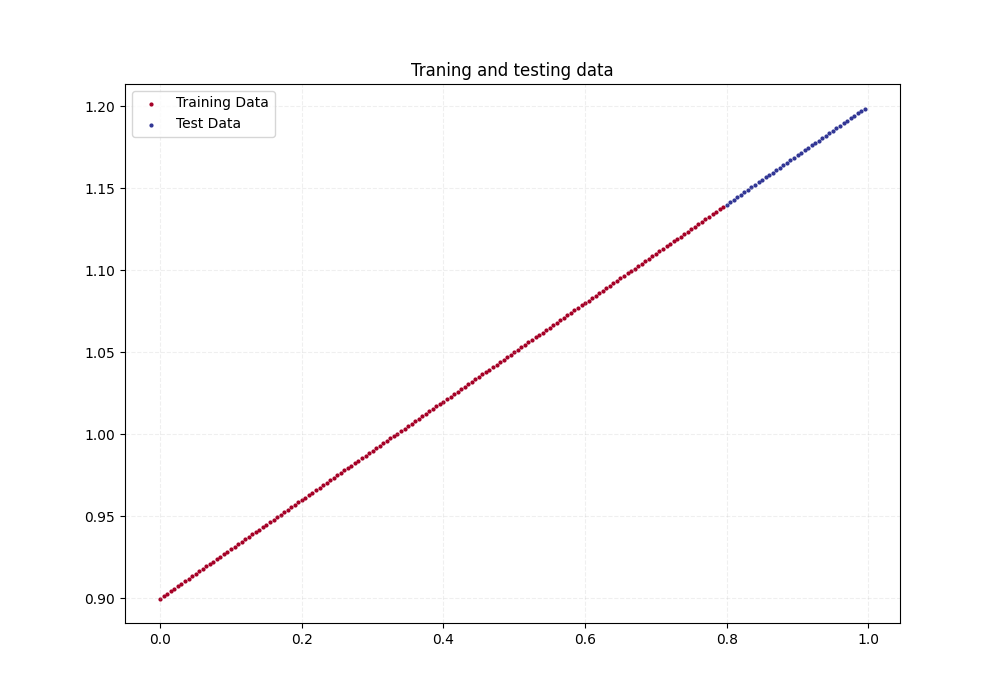
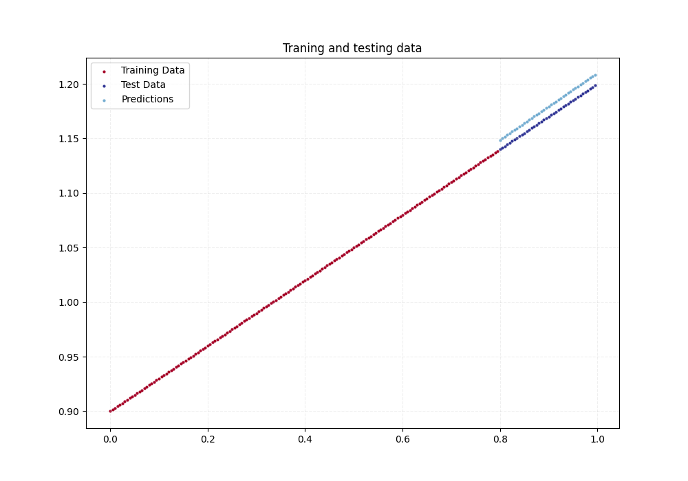

# PyTorch Workflow Fundamentals
In this chapter some of the most fundamental parts in 
building an Machine Learning model is being gone through.
All the way from splitting the data into *Training* and 
*Testing* sets to saving the trained model.

The workflow that this model entails is one with a *ground thruth*,
meaning that we actually create the data from a linear regression 
formula. But even though we actually know the parameters that our 
model will find in the data will this still be a good first model to
build.

## Exercise 1 
> Create a straight line dataset using the linear regression formula `(weight * X + bias)`. 
Set weight to 0.3 and bias to 0.9 and split the data into 80% training and 20% testing and 
plot the data 

```py linenums="1"
def e1(self):
    """First exercise of Chapter 1

    In this exercise will data be created using the linear
    regression formula. The data will be split in training and
    testing data (80/20 split) and plot the training and testing
    data for visualization
    """
    self.logger.info("--- Running Exercise 1 ---")
    bias = 0.9
    weight = 0.3
    start = 0
    end = 1
    step = 0.005

    X = torch.arange(start, end, step).unsqueeze(dim=1)
    y = weight * X + bias

    split = int(0.8 * len(X))

    self.X_train = X[:split]
    self.y_train = y[:split]
    self.X_test = X[split:]
    self.y_test = y[split:]

    self.logger.info("Plotting training and testing data\n")
    plot_predictions(self.X_train,
                     self.y_train,
                     self.X_test,
                     self.y_test,
                     figname=self.assetsdir / "ch1e1.png")


```

I created the data by utilizing the `torch.arange()` function and then using the linear regression 
formula to create the outputs seen in lines 16 and 17. I then split the data in by finding index of 
80% of the data and then using slicing to order the data into training, and testing sets. This can be
seen in lines 19-24. I then created a plotting function to plot this data, which also could be used 
to plot *predictions* which is when the model is being used on testing data. Seen in the figure below 
is only the training and testing data

 

```py linenums="1"
def plot_predictions(train_data,
                     train_labels,
                     test_data,
                     test_labels,
                     figname,
                     predictions=None):

    gs = GridSpec(1, 1)
    fig = plt.figure(figsize=(10, 7))
    ax = fig.add_subplot(gs[0, 0])
    ax.set_title("Traning and testing data")
    ax.scatter(train_data, train_labels, c="dimgray", s=4, label="Training Data")
    ax.scatter(test_data, test_labels, c="orange",  s=4, label="Test Data")

    if predictions is not None:
        ax.scatter(test_data,
                   predictions,
                   c="tomato",
                   s=4,
                   label="Predictions")

    ax.legend()
    fig.savefig(figname, transparent=False)
    plt.close()

```

## Exercise 2

> Build a PyTorch model by subclassing `nn.Module`. In the model should *parameters* 
be initialized using the `nn.Parameters` used, setting it to random values. One parameter
for the weight for the bias. a `forward()` model should also be created to compute the linear 
regression. Also make an instance of the model and print the current parameters on the untrained
model.

The way of doing this is by creating a new class that inherits from the `nn.Module` class. The
`nn.Module` class contains more or less every building block necessary for any kind of *Neural Net*.
Below is my implementation:

```py linenums="1"
class LinearRegressionModel(nn.Module):
    def __init__(self):
        super().__init__()
        torch.random.manual_seed(42)
        self.bias = nn.Parameter(torch.randn(1, 
                                             requires_grad=True, 
                                             dtype=torch.float))
        self.weight = nn.Parameter(torch.randn(1, 
                                               requires_grad=True, 
                                               dtype=torch.float))

    def forward(self, x: torch.Tensor) -> torch.Tensor:
        return self.weight * x + self.bias
```

As instructed I created parameters for the *bias* and the *weight* using the `nn.Parameters`
class, and setting those parameters to random values with `torch.randn`. Seen in the creation
of these, I set the argument `requires_grad` to True. This is needed if gradient descent is used 
to find these values in the training, which is the most standard way of solving a problem of this 
kind. 

I also implemented a `forward()` method for this model, which always has to be done when inheriting
from `nn.Module`. This method is used to propagate through the neural net and will do the predictions
from the input data.


To initialize this model I just call this model, and to print out the current parameters is the method
`state_dict()` called on the newly initialized model object, as seen below

```py linenums="1"
def e2(self):
    """Second exercise of Chapter 1

    In this we shall construct a linear regression model with
    randomized parameters. We should also construct a forward
    method that gives the prediction from the input and
    parameters. We should the initiate this model and print out
    the current parameters.
    """
    self.logger.info("--- Running Exercise 2 ---")
    self.logger.info("Initiating the model")
    self.model = LinearRegressionModel()
    params = self.model.state_dict()
    self.logger.info(f"Current parameters:\n {params}\n")
```
## Exercise 3 
> Create a loss function and optimizer using nn.L1Loss() and torch.optim.SGD(params, lr) respectively.
Set the learning rate of the optimizer to be 0.01 and the parameters to optimize should be the model parameters from the model you created in 2.
Write a training loop to perform the appropriate training steps for 300 epochs.
The training loop should test the model on the test dataset every 20 epochs.

The *loss function* and the *optimizer* is two of the most fundamental things there is when it comes 
to machine learning. 

* The loss function dictates how the loss is measured, meaning how much the predicted
data deviates from the expected output. This function will depend on what type of problem
you are trying to solve. But in this exercise I was instructed to use the `nn.L1Loss()` function,
which actually measures the *mean absolute error*.

* The optimizer is a function that tells the model how the parameters should be updated. These
functions also take the very important hyperparameter `lr`, which is the learning rate. This 
hyperparameter is very important because it tells the model how aggressively the model should update 
the models parameters. The optimizer we were instructed to use here implements stochastic gradient descent
and is found in the `torch.optim` module.

The training loop typically follows the below pattern, and in the code snippet below is my implementation

1. forward pass (moving the input data through the network) to give a output on the current parameters 
2. calculate the loss with the loss function 
3. optimizer zero grad, resets the gradients of the optimized tensor.
4. back propagation moves the data through the network backwards (calculate the loss gradients)
5. optimizer step, refining the parameters (gradient descent)

```py linenums="1"
    def e3(self, epochs):
        """Third exercise of Chapter 1

        In this exercise we are supposed to develop the training
        loop and also print out how the loss progresses

        Args:
            epochs (int): Number of times the model should fun through the NN
        """
        self.logger.info("--- Running Exercise 3 ---")
        self.logger.info("Creating loss and optimizer functions")
        self.loss = nn.L1Loss()
        self.optimizer = torch.optim.SGD(
            params=self.model.parameters(),
            lr=0.01
        )

        self.epochs = epochs
        self.logger.info("Entering training loop")

        # training loop
        for epoch in range(self.epochs):

            # set model into training mode
            self.model.train()

            # forward pass through network
            y_pred = self.model(self.X_train)

            # calculate loss
            loss = self.loss(y_pred, self.y_train)

            # set optimizer to zero gradient
            self.optimizer.zero_grad()

            # back propagate
            loss.backward()

            # step the optimizer
            self.optimizer.step()

            # enter testing mode
            self.model.eval()
            with torch.inference_mode():
                test_pred = self.model(self.X_test)
                test_loss = self.loss(test_pred, self.y_test)

                if epoch % 20 == 0:
                    print(f"Epoch: {epoch} | Train loss: {loss} | Test loss: {test_loss}")

        self.logger.info("Training done\n")
```

## Exercise 4 
> Make predictions with the trained model on the test data.
Visualize these predictions against the original training and testing data 
(note: you may need to make sure the predictions are not on the GPU if you want to use non-CUDA-enabled libraries such as matplotlib to plot).

This exercise is all about visualizing how well our model predicts the testing data. To get the predictions
I first put the model in *evaluate* mode with the method `eval()` and do the prediction in inference mode with 
`torch.inference_mode()`. This can be seen in the code snippet below, and the visualization of the training, testing 
and predicted data can be seen in the figure below

```py linenums="1"
def e4(self):
    self.logger.info("--- Running Exercise 4 ---")
    self.model.eval()
    with torch.inference_mode():
        predictions = self.model(self.X_test)

    self.logger.info("Plotting the predictions\n")
    plot_predictions(
        train_data=self.X_train,
        train_labels=self.y_train,
        test_data=self.X_test,
        test_labels=self.y_test,
        figname=self.assetsdir / "ch1e4.png",
        predictions=predictions
    )
```
 

## Exercise 5
> Save your trained model's state_dict() to file.
Create a new instance of your model class you made in 2. and load in the state_dict() you just saved to it.
Perform predictions on your test data with the loaded model and confirm they match the original model predictions from 4.

To save the trained model I created a separate function as can be seen below
```py linenums="1"
def save_model(model, name):
    modeldir = Path("models")
    basedir = Path(__file__)
    savedir = basedir.parent / modeldir

    if not savedir.exists():
        savedir.mkdir()

    torch.save(obj=model.state_dict(),
               f=savedir / name)

```

Here I pass in the *model* as one of the argument and a second argument, *name* which will be
under what name the models parameters will be saved. I also create a directory called `models/`
where the model will be saved.

**TODO**
* create function for loading the model and also ensure that the loaded model will give the same 
predicted values as the model that was saved.

