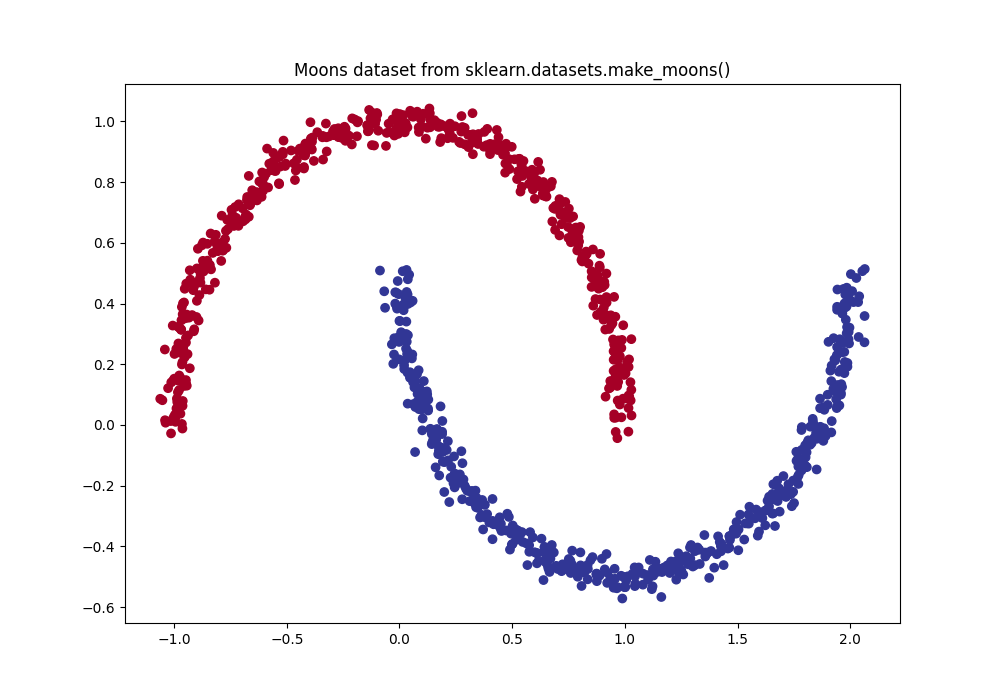
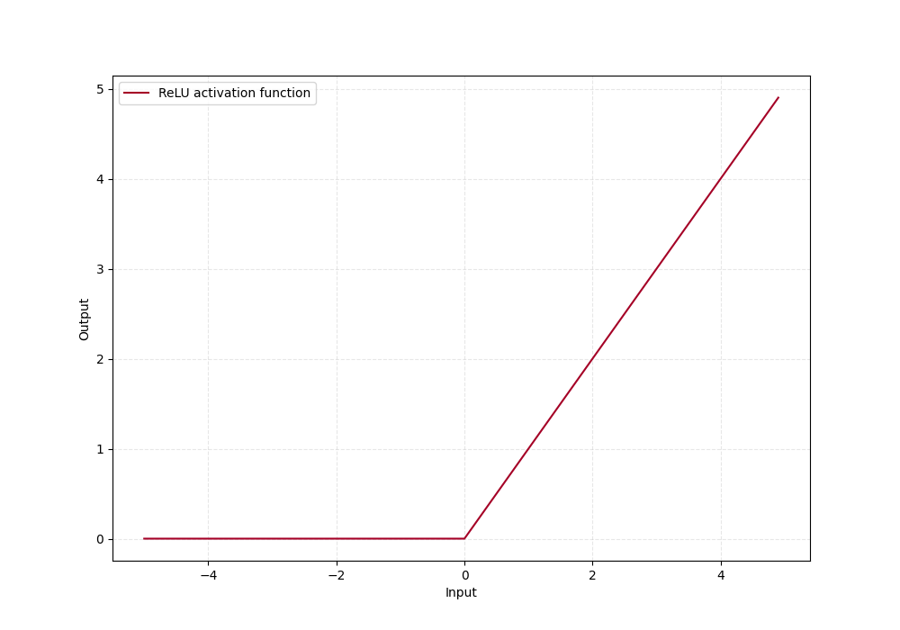
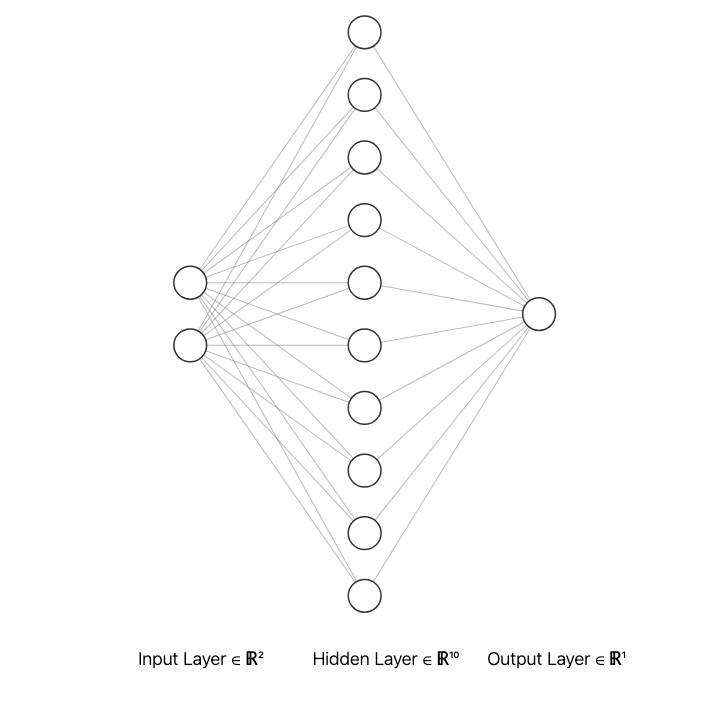
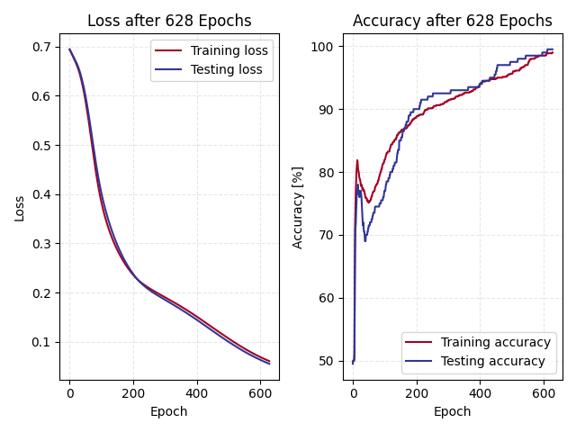
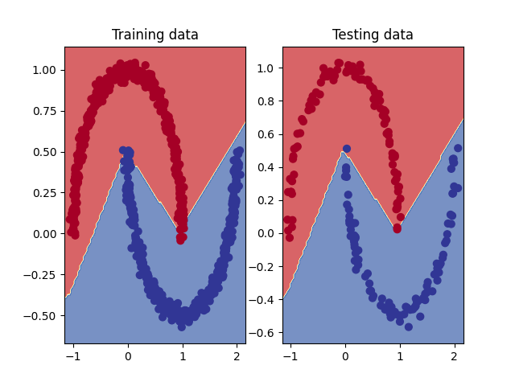
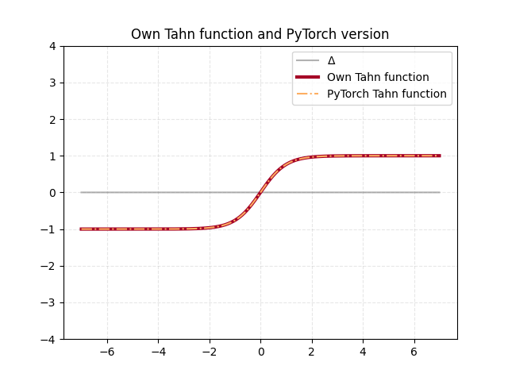

# PyTorch Neural Network Classification

In this chapter will a classification model be built, which
will be try to classify non linear data that is downloaded
from [sci-kit learn](https://scikit-learn.org/stable/). This 
dataset belong to the many *toy* datasets that sci-kit learn
has. 

## Exercise 1

> Make a binary classification dataset with sklearns make_moons()
method:. For consistency, the dataset should have 1000 samples and 
a random state of 42 Turn the data into PyTorch tensors. Split data
into 80/20 training and testing sets

To load in the dataset will be done with the `make_moons()` which is 
composed by two interleaving half circles. This is loaded from sci-kit learns
`datasets` module as seen in the code snippet. I set the random seed
to 42 as instructed and also add some noise to the data.

```py
self.X, self.y = make_moons(n_samples=samples,
                            noise=noise,
                            random_state=42)
```

To convert the data from numpy to tensors I use the `from_numpy()` method in PyTorch
and then split the data into training and testing data from another function 
in sci-kit learn, called `train_test_split()` this function splits the data 
randomly and can be seen in the snippet below

```py
self._X = torch.from_numpy(self.X).type(torch.float)
self._y = torch.from_numpy(self.y).type(torch.float)

# set training and testing sets
self.logger.info("Divide dataset into 80/20 train test split, randomly")
(self.X_train, self.X_test, self.y_train, self.y_test) = train_test_split(
    self._X,
    self._y,
    test_size=0.2,
    random_state=42
)
```

I then chose to plot the full dataset to visualize the data, which always is
good to do.

 

## Exercise 2

> Build a model by subclassing nn.Module that incorporates non-linear
activation functions and is capable of fitting the data from exercise 1.

In this exercise I will build a model that will be able to make the classification
of the *make moons* dataset by labeling correctly. One very important insight in this
exercise is that this data differs in several way in comparison to the data I created
in [Chapter 1](01.md). Firstly, it is a classification problem, and 
not a regression problem. Secondly the data is *non*-linear, which mean that a model
similar to the one developed in [Chapter 1](01.md) will not be sufficient
to classify the data.

This mean that we have to include non-linearity in our neural network. PyTorch have 
lots of functions that does this, and some work better than others, depending on the 
dataset that the model is built on. The one used in this exercise is the 
Rectified Linear Unit(ReLU) function with [torch.nn.ReLU](https://docs.pytorch.org/docs/stable/generated/torch.nn.ReLU.html), 
which can be seen in the figure below

 

The model setup is very similar to the one model developed in [Chapter 1](01.md), but 
with a few important changes. I now is setting up in total of three *layers*, which essentially consist 
of:

* **Input** layer with two input features (x, y) that has 10 output features
* One hidden layer with 10 input features and 10 output features
* **Output** layer with 10 input features and 1 output feature (the classification)

As seen in the `__init__` constructor in the snippet below. Be also define the 
non linear activation function, `nn.ReLU()` here.

```py linenums="1"
class MoonsModel_relu(nn.Module):
    """
    Classifier model with ReLU activation
    """

    def __init__(self):
        """Initialize layers and activation function"""
        super().__init__()

        # layers 1,2,3 and non linear activation function (ReLU)
        self.input = nn.Linear(in_features=2, out_features=10)
        self.hidden1 = nn.Linear(in_features=10, out_features=10)
        self.output = nn.Linear(in_features=10, out_features=1)
        self.relu = nn.ReLU()

    def forward(self, x: torch.Tensor):
        """Forward pass

        Neural network with activation between layers

        Args:
            x: Input
        """
        # neural network
        forward_pass = self.output(self.relu(self.hidden(self.relu(self.input(x)))))
        return forward_pass
```

The forward propagation through the neural network is constructed in the `forward()` method
as seen in the snippet, where the outputs between each layer goes through the ReLU activation
function. A visual representation of this neural network can be seen in the figure below

 

## Exercise 3

As for the model developed in [Chapter 1](01.md) we have to define a loss and optimizer function.
For binary classification problems like this will the [nn.BCEWithLogitsLoss()](https://docs.pytorch.org/docs/stable/generated/torch.nn.BCEWithLogitsLoss.html) 
loss function. This measures the Binary Cross Entropy loss between the target and input probabilities. This loss function
outputs the logits from the neural network. Logits is the raw outputs from the last layer, and have to be transformed 
to our labels in order for us to visualize how well our model is predicting. The optimizer function 
(which in many cases is standard) used here is again the `nn.optim.SGD()` which implements the stochastic gradient descent

## Exercise 4
> Create a training and testing loop to fit the model you created in 2 to the data you created in 1.

As for the model trained in [Chapter 1](01.md) we follow the standard pattern with some extra calculations
as shown in the code snippet below:

1. Putting the model in training mode
2. Running training data through the neural net and calculating predictions from logits
3. Optimizer zero gradient
4. Back propagate
5. Step optimizer
6. Evaluate

```py linenums="1"
for epoch in range(epochs):
    # set model in training mode
    self.model_relu.train()

    # forward pass
    logits = self.model_relu(self.X_train).squeeze()
    y_pred = torch.round(torch.sigmoid(logits))

    # calculate loss
    loss = self.loss_fn(logits, self.y_train)

    # zero grad
    self.optimizer_relu.zero_grad()

    # back propagate
    loss.backward()

    # optimizer step
    self.optimizer_relu.step()
```

I chose to evaluate the model with both training and testing data for each epoch, this because we wanted
to finish the training of the model when it reached atleast 99% accuracy. To do this I used [TorchMetrics](https://lightning.ai/docs/torchmetrics/stable/) 
and the method `torchmetrics.functional.accuracy()`. To illustrate how the loss and accuracy evolves through 
the training of this model I graphed out the loss and accuracy curves as seen in the figure below

 


## Exercise 5
> Make predictions with your trained model and plot them using the plot_decision_boundary() function created in this notebook.

To further visualize how well trained our model is, and how well it can make predictions can a figure that plots the 
boundaries of the decision be done. For this is a resource from 
[GitHub](https://github.com/mrdbourke/pytorch-deep-learning/blob/main/helper_functions.py) used called `plot_decision_boundary()`,
which I modified to suit my style of using axes to plot which can be seen in the 
code snippet below.

```py linenums="1"
def plot_decision_boundary(ax, model: torch.nn.Module, X: torch.Tensor, y: torch.Tensor):
    """Plots decision boundaries of model predicting on X in comparison to y.

    Source - https://madewithml.com/courses/foundations/neural-networks/ (with modifications)
    """
    # Put everything to CPU (works better with NumPy + Matplotlib)
    model.to("cpu")
    X, y = X.to("cpu"), y.to("cpu")

    # Setup prediction boundaries and grid
    x_min, x_max = X[:, 0].min() - 0.1, X[:, 0].max() + 0.1
    y_min, y_max = X[:, 1].min() - 0.1, X[:, 1].max() + 0.1
    xx, yy = np.meshgrid(np.linspace(x_min, x_max, 101), np.linspace(y_min, y_max, 101))

    # Make features
    X_to_pred_on = torch.from_numpy(np.column_stack((xx.ravel(), yy.ravel()))).float()

    # Make predictions
    model.eval()
    with torch.inference_mode():
        y_logits = model(X_to_pred_on)

    # Test for multi-class or binary and adjust logits to prediction labels
    if len(torch.unique(y)) > 2:
        y_pred = torch.softmax(y_logits, dim=1).argmax(dim=1)  # mutli-class
    else:
        y_pred = torch.round(torch.sigmoid(y_logits))  # binary

    # Reshape preds and plot
    y_pred = y_pred.reshape(xx.shape).detach().numpy()
    ax.contourf(xx, yy, y_pred, cmap=plt.cm.RdYlBu, alpha=0.7)
    ax.scatter(X[:, 0], X[:, 1], c=y, s=40, cmap=plt.cm.RdYlBu)
    ax.set_xlim(xx.min(), xx.max())
    ax.set_ylim(yy.min(), yy.max())
```

To use this function I start by initializing a figure object and then calling 
the modified `plot_decision_boudary()` function with the axis, model, and test data.
Below is this plot for the model trained here.

 


## Exercise 6

> Replicate the Tanh (hyperbolic tangent) activation function in pure PyTorch.

Another activation function that is used in classification problems is the Tanh function
which exist in the PyTorch library. In this exercise I am creating it myself in pure 
PyTorch. See the code snippet below for the code and the figure below the snippet for an 
comparison between PyTorchs own, and the one I developed.

```py linenums="1"
def tanh(x: torch.Tensor) -> torch.Tensor:
    y = (torch.exp(x) - torch.exp(-x)) / (torch.exp(x) + torch.exp(-x))
    return y
```

 


